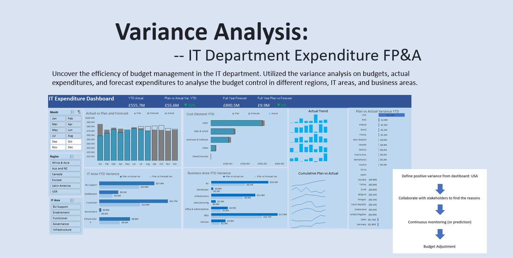
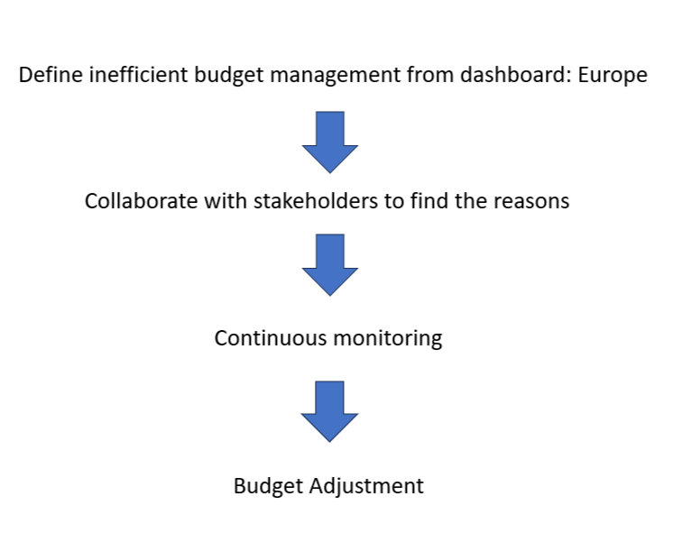

# Variance Analysis: IT Department Expenditure FP&A

## Table of Contents
- [Technologies](#technologies)
- [Abstract: Business Intelligence](#abstract-business-intelligence)
    - [Problem](#the-problem)
    - [Solution](#the-solution)
    - [Results](#results)
- [Procedures](#procedures)
- [Dashboard](#dashboard)
- [Report](#report)
- [Reference](#reference)

## Techonologies

1. Excel
- Pivot Tables & Pivot Charts

2. Variance Analysis

## Abstract: Business Intelligence

This is a financial planning and analysis project where I analyzed the planned, actual, and forecasted expenditures in IT department in Company X, utilizing the variance analysis. I helped the company to understand the performance of their expenditure management, point out the potential risks and provide corresponding suggestions.

- ### The Problem
The financial officers in Company X approach the FP&A team for insights into this year’s financial performance of the IT department. There are some questions that she is interested in:

1. How is the performance of the current plan on expenditure?

2. How much does planned and actual expenditure differ?
  
3. How is the budget performance in sub IT areas / regions / business areas?

- ### The Solution
To address the stakeholders' needs, I gathered data from expenditure database. I found that there are data information about planned expenditure for year 2023, actual expenditure from January to August, and forecast expenditure from September to December.

To create the comparibility among expenditures, I utilized and built the following metrics to help analyze the data further:

- Plan vs Actual Variance

It can analyse how well company X adhered to its initial budget and identify the reasons for any differences between them.

- Plan vs Actual Variance Percentage

- Plan vs Forecast Variance

It can help Company X adapt to changing circumstances and make informed decisions.

- Plan vs Forecast Variance Percentage

I then organize the data and build pivot tables and charts to generate dashboard and report for stakeholders to monitor the budget performance.

- ### The Results

## Procedures

In this step, I created 4 performance metrics and 9 pivot tables to streamline the data analysis.

- 1. Format the source data

In Excel, format the data worksheet as a table

- 2. Summarize with pivotTables in the new worksheets

- 3. Calculate Fields

Calculate the 4 metrics

- Plan vs Actual Var. = `Plan` - `Actual`

- Plan vs Actual Var. % = (`Plan` - `Actual`)/`Actual`

- Plan vs Forecast Var. = `Plan` - `Forecast`

- Plan vs Forecast Var.% = (`Plan` - `Forecast`)/`Forecast`

- 4. Format the numbers

Format the numbers in `£0.0,,"M";(£0.0,,"M");`, and format the percentage number in `0.0%;(0.0%);`

- 5. Create Pivot Charts and dashboards

Please see the next section for details

- 6. Automate the results

After building the dashboard with pivot tables, it also creates an automating system where further data input can be shown on the dashboard automatically. It saves much business time.

## Dashboard

|Variance Analysis|
|-------------|
||

## Report
This report covers problems analyzed from the dashboard and I also provided suggested adjustments. Overall, Company X did well in budget management in 2023, with an actual expenditure of £55.6M lower than the budget. Except for May, it has controlled the actual expenditure under budgets in other months.

- Inefficient Budget Control in Europe

In Europe, there are negative values in metric `Plan vs Actual Var.` in 3 areas in IT Areas and 4 areas in Business Areas. It suggests overspending or inefficient cost control. This can be a red flag for financial management.

In IT Areas in Europe, the budget in `Functional` area exceeds the actual expenditure by £1.5M, yet in `Enablement` and `Governance` areas, the figures are around £-0.8M. The same situation happened in Business Area as well. However, this imbalance contributed to the overall `Plan vs Actual Var.` in Europe to be positive in year 2023, which is £0.1M.

I suggest that company X should follow this strategy for further analysis and monitoring:

|Strategy for Europe|
|-------------|
||

Company X should figure out the factors contributing to the risk by collaborating with stakeholders. Continuous monitoring is also suggested to see if there is a trend in inefficient budget estimations in the long run.

Finally, Company X could choose to adjust future budgeting practices. This may involve refining estimation methods or incorporating more current data into initial budget assumptions. Note: a budget adjustment requires careful analysis to ensure the departments’ essential functions and goals are not compromised.

- Large Variance in USA

USA has a noteworthy positive variance between budget and actual expenditure, which is £52.9M. It indicates the efficient cost management and financial health in USA. However, it might suggest that the initial budgeting process was not accurate or that unforeseen circumstances impacted the financial plan.

I suggest that company X should follow this strategy for further analysis and monitoring:

|Strategy for USA|
|-------------|
||

Firstly, identify the reason behind it with stakeholders. Possible reasons can be one-time factors, operational efficiency, external factors and successful strategies.

Then, continuous monitoring (or accessing forecast data) to see the sustainability of the positive variance. If this positive variance leads to a positive performance figure, it might justify an increase in budget. Otherwise, it will need an accurate reduction to adhere to its actual expenditure.

## Reference
[@MyOnlinetrainingHub](https://www.youtube.com/watch?v=_PlBRWc0RlI&ab_channel=MyOnlineTrainingHub)